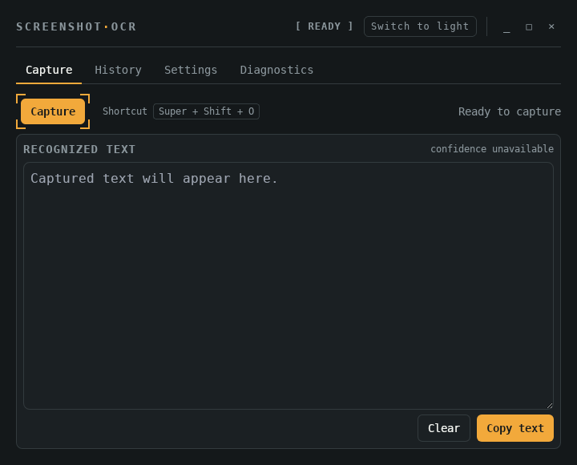

# Screenshot OCR

[](https://github.com/ekkus93/screenshot-ocr/actions/workflows/ci.yml)

Screenshot OCR is a privacy-first Linux desktop utility for selecting visible screen text, recognizing it locally with Tesseract, and copying it to the clipboard. It is optimized for terminal output, source code, and developer punctuation.



> **Status:** pre-release. Automated development is active; the mandatory Ubuntu 22.04/24.04 Wayland/X11 validation matrix is not yet complete.

## Initial platform scope

- Ubuntu 22.04 LTS, GNOME Wayland and X11
- Ubuntu 24.04 LTS, GNOME Wayland and X11
- English OCR with Tesseract 5
- GNOME screenshot helper compatibility backend
- `.deb` release package built on Ubuntu 22.04

Other distributions and desktop environments are unverified.

## Architecture

- React, TypeScript, Vite, and Tailwind CSS frontend
- Tauri 2 desktop shell
- Rust application core for capture, image processing, OCR, settings, diagnostics, clipboard policy, and privacy-sensitive behavior
- Local-only OCR; no capture or recognized text is sent over the network

See:

- [v0.1 specification](docs/SCREENSHOT_OCR_V0_1_SPEC.md)
- [implementation TODO](docs/SCREENSHOT_OCR_V0_1_TODO.md)
- [architecture](docs/ARCHITECTURE.md)
- [privacy](docs/PRIVACY.md)
- [threat model](docs/THREAT_MODEL.md)
- [CI status bridge](docs/CI_STATUS_BRIDGE.md)
- [synthetic OCR fixtures](docs/OCR_SYNTHETIC_FIXTURES.md)

## Development prerequisites

Ubuntu 22.04 build packages:

```bash
sudo apt-get update
sudo apt-get install --yes \
  build-essential curl file libayatana-appindicator3-dev librsvg2-dev \
  libssl-dev libwebkit2gtk-4.1-dev libxdo-dev pkg-config wget
```

Runtime packages for the compatibility path:

```bash
sudo apt-get install --yes gnome-screenshot tesseract-ocr tesseract-ocr-eng
```

The project pins Node and Rust versions (`.node-version`, `src-tauri/rust-toolchain.toml`). Run `scripts/check-dev-tools.sh` to inspect prerequisites without modifying the host.

## Running it in development

```bash
npm ci
npm run tauri dev
```

This starts the Vite dev server and launches the Tauri window against it, with hot reload on frontend changes. Rust changes require a restart.

## Validation

```bash
npm ci
npm run validate
cargo fmt --manifest-path src-tauri/Cargo.toml --all -- --check
cargo clippy --manifest-path src-tauri/Cargo.toml --workspace --all-targets --all-features --locked -- -D warnings
cargo test --manifest-path src-tauri/Cargo.toml --workspace --all-features --locked
npm run tauri build
```

Hosted CI on Ubuntu 22.04 is authoritative for compilation and linting. Physical desktop validation remains a separate release gate.

`npm run tauri build` produces `src-tauri/target/release/bundle/deb/Screenshot OCR_<version>_amd64.deb`. A separate Playwright suite (`npm run test:layout`) checks that the Capture/Settings/Diagnostics tabs never require scrolling at the app's window size; it runs in CI but is not part of `npm run validate` since it needs a browser install step.

## Installing the built package

```bash
sudo dpkg -i "./src-tauri/target/release/bundle/deb/Screenshot OCR_0.1.0_amd64.deb"
sudo apt-get install -f
```

`dpkg -i` installs the local file directly. The follow-up `apt-get install -f` resolves any missing runtime dependencies (`gnome-screenshot`, `tesseract-ocr`) if they aren't already on the system; it's a no-op otherwise. (`sudo apt install ./path/to.deb` also works, but if your home directory isn't world-readable — `750` is Ubuntu's default — apt prints a harmless `pkgAcquire::Run (13: Permission denied)` sandboxing notice for local files under it; `dpkg -i` avoids that entirely since it never runs apt's sandboxed-download step.)

This installs the binary, the `.desktop` entry, and the app icon (`/usr/share/icons/hicolor/*/apps/screenshot-ocr.png`) — the desktop icon and taskbar entry only appear after installing this way, not when running the binary directly out of `target/release/`. To remove it:

```bash
sudo apt remove screenshot-ocr
```

## Shortcut, tray, and startup capture

The documented default shortcut is `Super+Shift+O`.

On GNOME Wayland, create a custom keyboard shortcut that runs:

```text
screenshot-ocr capture
```

The application does not modify GNOME settings automatically.

On Linux X11, the app attempts direct registration of `Super+Shift+O` and reports the registration result in diagnostics. On Wayland, diagnostics tell the user to use the GNOME custom shortcut path instead.

The binary recognizes only these exact first arguments:

```text
capture
cancel
toggle
show
quit
```

Unknown second-instance invocations only show the main window. They do not start capture implicitly.

The tray menu currently exposes only implemented actions:

```text
Capture text
Cancel capture
Show Screenshot OCR
Quit
```

There is no Settings tray action yet. Start-at-login, close-to-tray, and notification-after-copy are reserved pre-release settings and are not active behavior in this build.

`quit` cancels an active capture before exiting. The app does not currently keep running after the window is closed as a tray-only background utility.

## Fixture policy

Automated OCR cleanup tests use synthetic text fixtures only. Do not commit private screenshots, real OCR output, clipboard text, temporary paths, portal result URIs, or helper stdout/stderr from a real machine.

See [synthetic OCR fixtures](docs/OCR_SYNTHETIC_FIXTURES.md).

## License

MIT. See [LICENSE](LICENSE).
